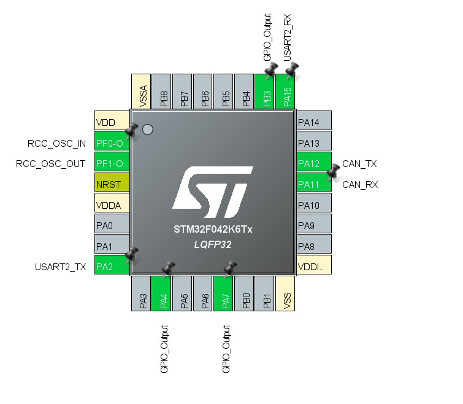
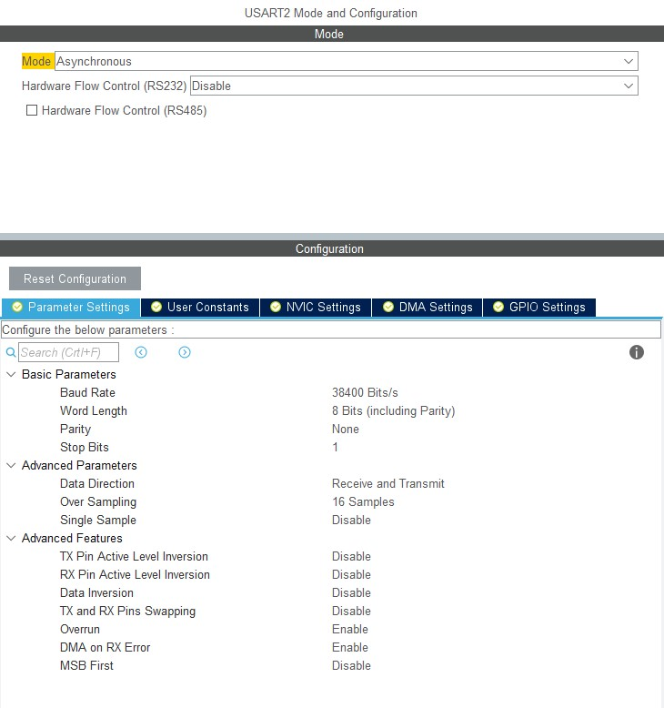

# Read-CAN-STM32

This is my attempt to document the process of configuring STM32 to read CAN data. The board used for this project is a **STM32F042K6 (Nucleo-F042K6)**.

In this project we have used a **Interrupt based** reading mechanism and we print the recieved CAN messages on the Serial Monitor. I have used the [STM32 Truck Shield](https://github.com/gannaramu/STM32F042K6-Shield) from my previous projects. we have used a MCP2562 as a CAN transciever in this project. For more information refer to the [schematic]

## Configuration
1. Configure the Pins.
    * The following image shows the pin configuration used in this project.
    
    

2. Configure the CAN.
    * The CAN Baud rate for this project is **250 kbit/s**. The clock is set to **48Mhz**. The Bit Timing for such configuration is as follows:
    
        | Prescalar | Bit Seg 1 | Bit Seg 2 |
        |:---------:|:---------:|:---------:|
        |    12     |  13       |     2     |
        
        Bit timing for other bit rates can be configured from [http://www.bittiming.can-wiki.info/](http://www.bittiming.can-wiki.info/)
        The configuration should look something like this:
        
        
     * Make sure you enable the Interrupt in the NVIC Settings. The Configuration for the STM32F402K6 looks like this:
        
        
        
 3. Configuring The Clock
     * We use the clock at 48Mhz in order to enable high CAN baudrates. The Clock configuration should look like this:
      
        
        
 4. Configure RCC
      * The RCC configuration should look like this:
      
         
         
 5. Configure UART (for printing messages on serial monitor)
          
          
          
After the Configuration the IDE should generate a bare code with all the peripharals configured.
